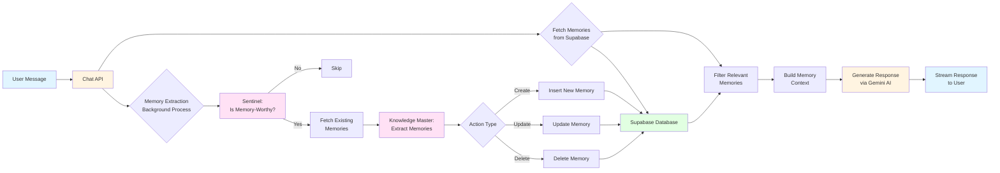

# Gemini Memory Manager - Methodology Diagram

```mermaid
flowchart LR
    A[User Message] --> B[Chat API]
    B --> C{Fetch Memories<br/>from Supabase}
    C --> D[Filter Relevant<br/>Memories]
    D --> E[Build Memory<br/>Context]
    E --> F[Generate Response<br/>via Gemini AI]
    F --> G[Stream Response<br/>to User]
    
    B --> H{Memory Extraction<br/>Background Process}
    H --> I[Sentinel:<br/>Is Memory-Worthy?]
    I -->|No| J[Skip]
    I -->|Yes| K[Fetch Existing<br/>Memories]
    K --> L[Knowledge Master:<br/>Extract Memories]
    L --> M{Action Type}
    M -->|Create| N[Insert New Memory]
    M -->|Update| O[Update Memory]
    M -->|Delete| P[Delete Memory]
    N --> Q[Supabase Database]
    O --> Q
    P --> Q
    
    C --> Q
    Q --> D
    
    style A fill:#e1f5ff
    style B fill:#fff4e1
    style I fill:#ffe1f5
    style L fill:#ffe1f5
    style Q fill:#e1ffe1
    style F fill:#fff4e1
    style G fill:#e1f5ff
```

